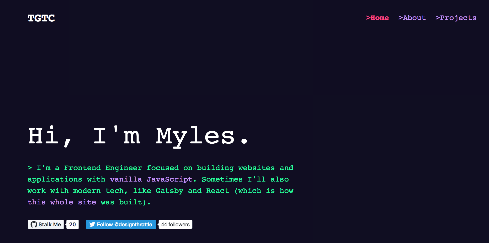

# Engineering Portfolio

Welcome to my personal software engineering portfolio. Here I plan to list all of my projects and hopefully talk about certain topics within the coding/user experience world.

I mainly work with JavaScript but will also explore general coding topics (ex. algorithms, data structures, etc). I try to tie all of this with the principles of User Experience.

This project first started off using [Gatsby's Hello World Starter theme](https://github.com/gatsbyjs/gatsby-starter-hello-world).

## Inside Look

The main theme for my portfolio is a terminal interface.

