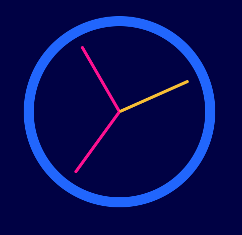
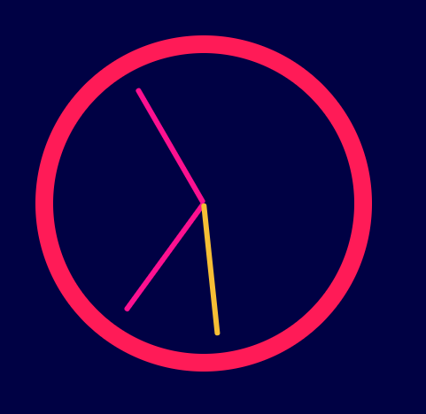

## The Gist

I've been working my way through Wes Bos' JavaScript 30 and one of the tutorials was building a simple JavaScript clock. I figured I'd go through it and add on a couple other features. Here's my walkthrough.

Here's what I eventually was able to make. Three different clock states for the three different times of day (ex. morning, afternoon, and evening):

<span></span>
<span></span>
<span></span>

## Walthrough

First I started with a basic set up. I created a folder named `js-clock`. And inside the folder, I had 3 files.

```text
// js-clock/

|_ index.html
|_ app.js
|_ styles.css
```

Nothing crazy.

### index.html

Here's the structure for the overal clock.

```html
// js-clock/index.html

<!DOCTYPE html>
<html lang="en">
  <head>
    <meta charset="UTF-8" />
    <meta name="viewport" content="width=device-width, initial-scale=1.0" />
    <meta http-equiv="X-UA-Compatible" content="ie=edge" />
    <title>The Clock</title>
    <link href="styles.css" rel="stylesheet" />
  </head>
  <body>
    <div id="clock" class="clock">
      <div class="clock-face">
        <div class="hand hour-hand"></div>
        <div class="hand min-hand"></div>
        <div class="hand second-hand"></div>
      </div>
    </div>

    <script src="/app.js"></script>
  </body>
</html>
```

As you can see we have the clock itself, its face, and the 3 individual hands within. Again, nothing too complicated or crazy.

### style.css

Here's what we have inside of `styles.css`:

```css
// js-clock/styles.css

/**
* These styles are taken from Wes Bos' JavaScript 30 and then extended upon
*/
html {
  background: #00004d;
  font-family: 'helvetica neue';
  text-align: center;
  font-size: 10px;
}
body {
  margin: 0;
  font-size: 2rem;
  display: flex;
  flex: 1;
  min-height: 100vh;
  align-items: center;
}
.clock {
  width: 30rem;
  height: 30rem;
  border: 20px solid #ae5dff;
  border-radius: 50%;
  margin: 50px auto;
  position: relative;
  padding: 2rem;
}
.clock-face {
  position: relative;
  width: 100%;
  height: 100%;
  transform: translateY(-3px); /* account for the height of the clock hands */
}
.hand {
  width: 50%;
  height: 6px;
  border-radius: 8px;
  background: #fd119b;
  position: absolute;
  top: 50%;
  transform-origin: right;
  transform: rotate(90deg);
  transition: all 0.05s;
  transition-timing-function: cubic-bezier(0, 2.21, 0.93, 0.96);
}

.second-hand {
  background: #f8c63c;
}

.morning-color {
  border: 20px solid hsl(219, 98%, 57%);
  transition: all 2s;
}
.afternoon-color {
  border: 20px solid #66ffb3;
  transition: all 2s;
}
.evening-color {
  border: 20px solid #ff1f62;
  transition: all 2s;
}
```

There are some classes that are self-explanatory, and some that I'll explain. The one's I'll bread down and explain are `.hand`, `.second-hand`, `.morning-color`, `.afternoon-color`, and `evening-color`.

Within `.hand` class definition, you'll notice a propery called `transform-origin` with the value `right`. The property `transform-origin` sets the point around which a transformation is applied. There are multiple values available but the one that I'm choosing is `right`. This is essentially saying, "When I apply tranformations to this element, transform around the right-most part of this element".

[illustration here]

You can read more details about it at [MDN Web Docs](https://developer.mozilla.org/en-US/docs/Web/CSS/transform-origin).
