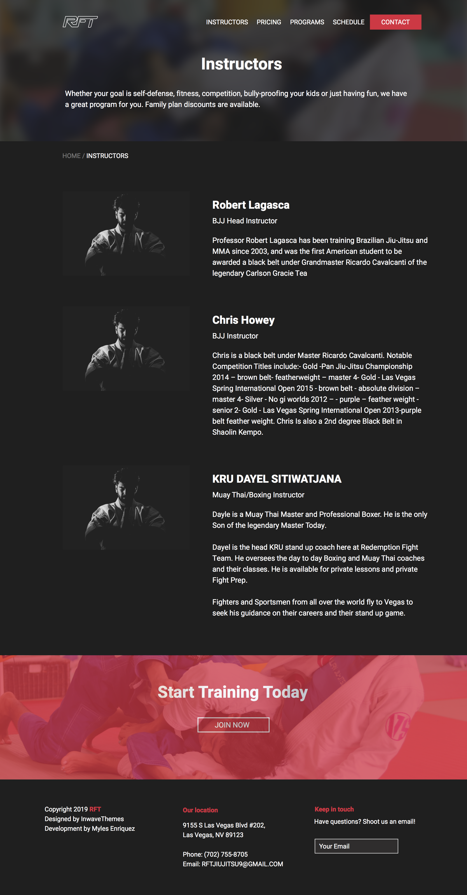
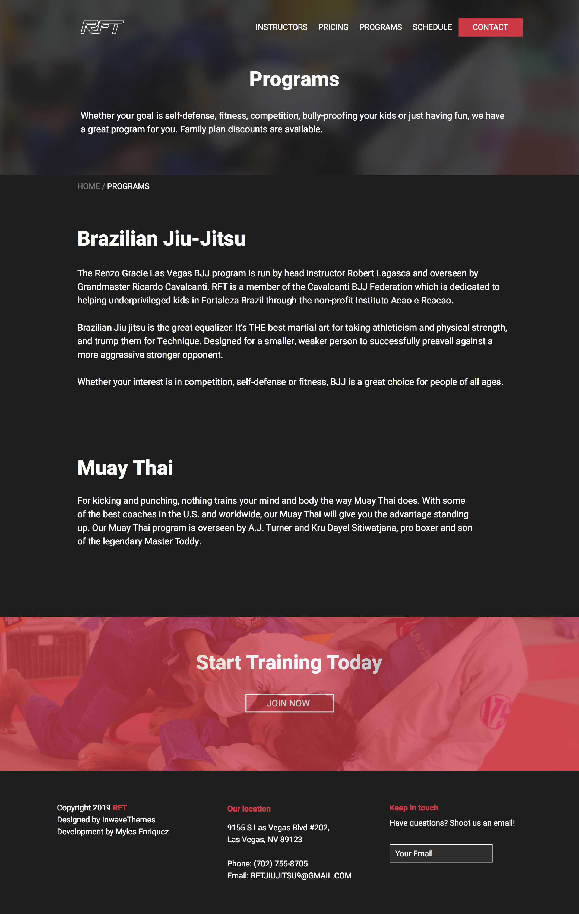
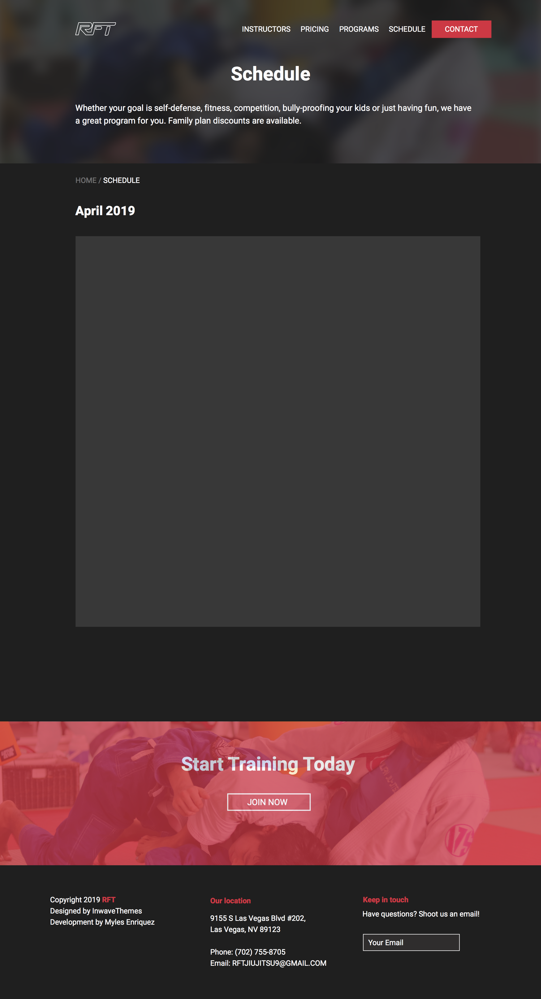
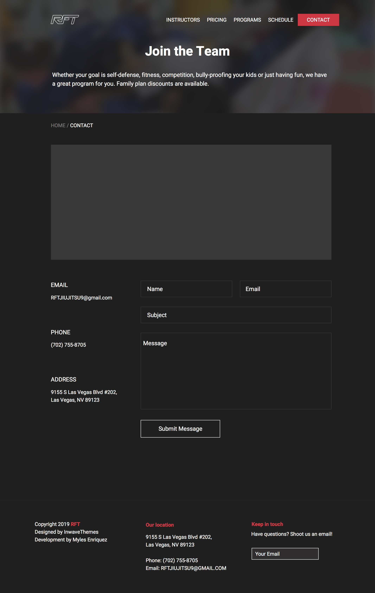

It's been awhile since I last redesigned an app/website so I gave myself the challenge to redesign the website for a MMA school that I go to, [Redemption Fight Team](http://www.redemptionfightteam.com/).

The current site is not horrible, but like all websites and apps, it could always be improved.

To me, it seemed as though the site did not have a goal prior to creation. I say this because it seemed as though content was just uploaded just to be there.

### Finding the Goal

So the first step for me was to define a goal and that goal was to get curious customers to convert and join the gym. With this goal in mind, I now had an endpoint. I knew where each user journey should eventually end up. It was important for me to define this because now I knew what could be removed from the original layout.

### Current Sitemap

The original site map looked like so:

```javascript
Home
|_Programs
|_Schedule
|_BJJ Videos
|_About Us
| |_Instructors
| |_Social
|
|_Contact
```

All the content for a working website was there, but it was not placed in the correct areas (if we're talking about getting those conversions).

### Our Audience

The primary target audience are parents. Now if we think like a parent, we can try to assume a couple things that they need. 

Those needs are:

- Schedule (because of work/school)
- Location
- Photos (need a peak for trust)
- Instructors (need to know how their kids will be with for those 2 hours)

Once these needs are met, you could assume that they would want to join. And that's were the convenience of joining is crucial.

Now I want to take a step back and mention that this is purely my assumption. I did not interview any users.

With this information I structured the site map like so:

```javascript
Home
|_Instructors
|_Pricing
|_Programs
|_Schedule
|_Contact
```

It's a lot simpler and provides the customer (parent) the information that they would need.

### Home Page

Here's what I designed for the home page:


Notes on the home page:

- Has more contrast with call to action buttons.
- Background images shows what a student would be doing in class.
- Clear explanation of what programs are offered.
- Display of pricing options. Giving the "Double" plan more contrast since it brings in more money for the business.
- Call to action at end to "hook in" the customer and seal the deal.


### Sub Pages

The sub-pages follow the same format to contain consistency. 

They consist of having:

- A header which describes where they are.
- Breadcrumbs which let the customer know where they are within the site.
- Content area displaying what they need in more detail.
- And a call to action to, again, "hook in" the customer.

 




### Contact Page

The contact page is where we seal the deal. This means that it needs to be clear and easy to use. It also has to have the last minute information that the customer may need.

This includes, but is not limited to:
- Location on map
- Email (not everyone likes to call these days)
- Phone
- Address
- Form



The reason for having a interactive google map and an address is because of the fact that not all customers may be comfortable with using the interactive map. To make sure they don't leave because of frustration, we include an easy to read address.

The reason for having an email and a form is pretty much because of the reasoning above. Not all users want to use a form. Some times a form may seem untrustworthy, so as an alternative we include an email address so that customers can use an mail client that they have more confidence in.

### Conclusion

This is only the first phase of these mockups and the design may change in the future. Essentially, I just wanted to try to things with these designs: (1) trip off the fat, and (2) define and server a target audience.


