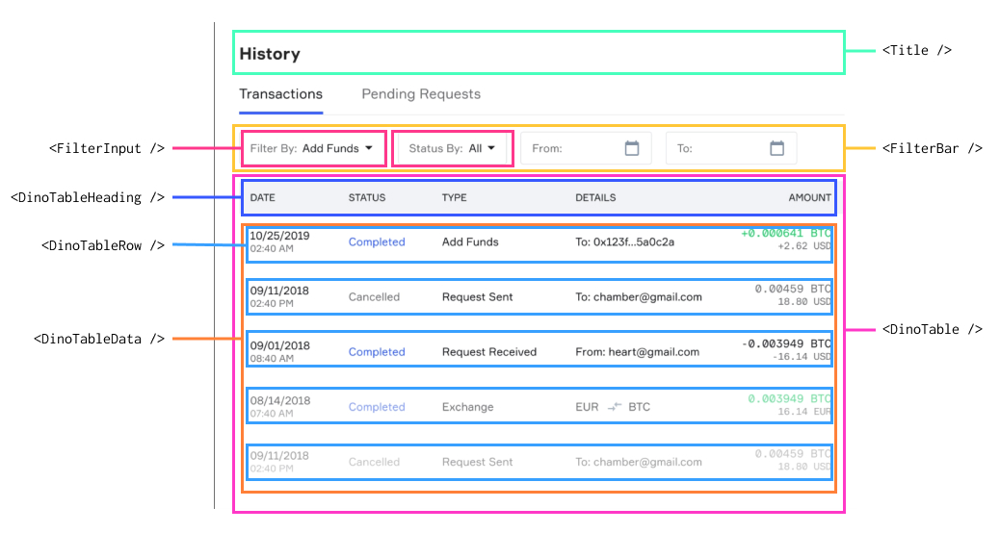

## Introduction

Lately, I've been reviewing algorithms. Seeing that I'm a frontend developer, I figured I should incorporate them into some user interfaces. For this project, I will be building a basic interface, and applying the Binary Search Algorithm.

The interface I will be building can be seen below.


**Disclaimer: This is not my original design. This interface design was create by [Anna Kukhareva](https://dribbble.com/phosphoricc) and can be seen on [Dribbble](https://dribbble.com/shots/5815853-History-Tab).**

I'll use this interface design as a basis to develop an application that searches through a [directory of dinosaurs](https://www.nhm.ac.uk/discover/dino-directory/name/a/gallery.html).

## Walkthrough

Alright, for those of you who need structure, here's the plan:

1. Component breakdown
2. Component Hierarchy
3. Build static UI with Reactjs (props only)
4. Build functional UI with Reactjs (props and state)
5. Apply Binary Search Algorithm within app.

### 1. Component Breakdown

First let's start by looking at the mock up and breaking it down into components. Not all elements within the mock up will be used. Instead of recreating the functionality of a table-like component, I will be using the `<table>` element itself with React components.



### 2. Component Hierarchy

With that being broken down nicely, I can list out my component hierarchy.

```text
<Title />
<FilterBar />
-- <FilterInput />
<DinoTable />
-- <DinoTableHeading />
-- <DinoTableData />
---- <DinoTableRow />
```

### 3. Build static UI with Reactjs (props only)

With the component hierarchy nicely listed, we can start building! We'll be taking a bottom-up approach when building out these components. First off is `<DinoTableRow />`.

`<DinoTableRow />`

```javascript
```

### 3. Apply Binary Search Algorithm within app.

Alright, so what is the Binary Search Algorithm? Well if you haven't been clicking on the links I've provided above, essentially it is a very fast searching algorithm. But there is a catch, it has to be used on data that has already been

## Conclusion
