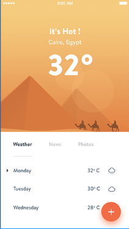
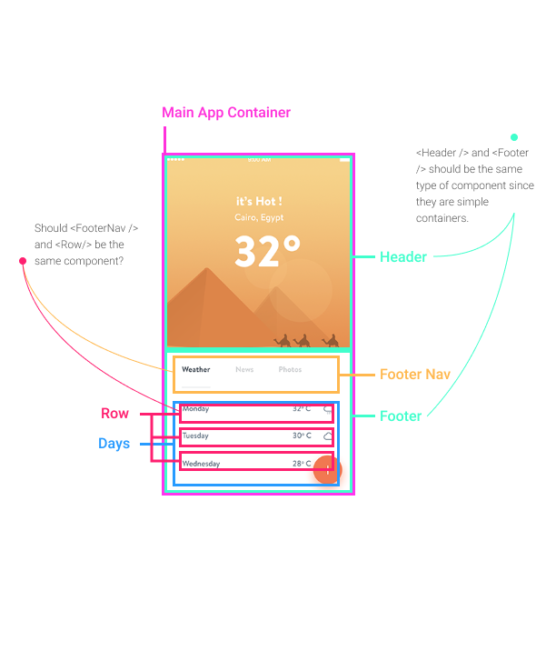

## Introduction

This walkthrough is first of a series I'm calling "UI Build It". Essentially, I just break down an interface and build a prototype the "React Way".

The actual steps to each of these projects in this series is to:

1. Pick an interface
2. Break it into a components
3. Organize the components into a hierarchy
4. Build a static prototype (using react props)
5. Build into a functioning prototype (using react props and state)

My main goal in this series is to get a better understanding of component composition within a React application. I will be using the official [Thinking In React Tutorial](https://reactjs.org/docs/thinking-in-react.html) to give my process a little structure. If you don't feel like reading the whole walkthrough, you can [check out the source code on codesandbox](https://codesandbox.io/s/weather-forecast-81nnh) or [check out the live demo](https://csb-81nnh.netlify.com/).

## The Walkthrough

I'm going to walk you through my process for building the interface below in React.



### 1. Break The UI Into A Component Hierarchy

After taking a look at the interface I broke it down like so:



The issues I came across had to do with reusability. I wasn't sure which components should be resused or not. At first glass the Header and Footer components seemed like they should be the same, but at second glance I decided to make them two completely different components. The reason being that they each had to represent and deal with different types of data.

The final list of components consisted of:

- `<ForecastApp />` (pink): contains the entirety of the application.
- `<ForecastAppHeader />` (teal, top): contains the current day weather details.
- `<ForecastAppFooter />` (teal, bottom): contains different views and current week data.
- `<ForecastFooterNav />` (orange): different tabs (will not be interactivefor this prototype)
- `<ForecastWeek />`(blue): contains all upcoming days and their forecast details.
- `<ForecastDay />` (red): contains the day, temperature, and icon representing the type of weather for the day

And the final component hierarchy:

```text
- <ForecastApp />
  - <ForecastAppHeader />
  - <ForecastAppFooter />
    - <ForecastFooterNav />
    - <ForecastWeek />
      - <ForecastDay />
```

### 2. Build A Static Version in React

Even though this application was small in size, I wanted to build out the application going bottom-top. So I started with the `<ForecastDay />` component.

```javascript
import React from "react";
import { Cloud } from "react-feather";

const styles = {
  display: "flex",
  justifyContent: "space-between",
  alignItems: "center"
};

class ForecastDay extends React.Component {
  render() {
    const { day, temp } = this.props;
    return (
      <div style={styles}>
        <p>{day}</p>
        <p>{temp}&#8457;</p>
        <p>
          <Cloud />
        </p>
      </div>
    );
  }
}

export default ForecastDay;
```

I imported `React` and `{ Cloud }` at the top. We need `React` in order for jsx to work and we need `{ Cloud }` to serve for our icon, which gets imported from feather, a collection of svg icons.

We then declare our styles to our `<div/>` I'm mainly just using this `<div/>` as a container, so only layout styles are applied using flex box.

Next is the actual component declaration. The `<ForecastDay />` component will be taking in 3 props. It needs a day, temperature, and a weather status. Since we are just creating a static app at this point (using props, not state), I'm only taking in day and temperature and using a placeholder for the weather status. For the time being the weather status will just be an icon which was imported at the top from feather icons. Eventually, `<ForecastDay />` will be passed a weather status, and from this will will use logic to render the correct icon.

Finally, we export the component.

Next, let's build `<ForecastWeek />`.

```javascript
import React from "react";
import ForecastDay from "./ForecastDay";

const styles = {
  display: "flex",
  flexDirection: "column",
  justifyContent: "space-between"
};

class ForecastWeek extends React.Component {
  render() {
    return (
      <div style={styles}>
        <ForecastDay day="Mon" temp={65} />
        <ForecastDay day="Tues" temp={72} />
        <ForecastDay day="Weds" temp={70} />
        <ForecastDay day="Thurs" temp={69} />
      </div>
    );
  }
}

export default ForecastWeek;
```

Pretty similiar to the `<ForecastDay />` component, `<ForecastWeek />` takes imports react and then we also import `<ForecastDay />`.

Once again, we declare our styles which will be for a `<div/>` that will act as a container. So simple layout styles are applied using [flex box](https://css-tricks.com/snippets/css/a-guide-to-flexbox/).

Essentially, the `<ForecastWeek />` component is just a container for multiple `<ForecastDay />` components. For each `<ForecastDay />` component, we pass in a day and temp prop.

Lastly, we export the component.

Next, `<ForecastFooterNav />`.

```javascript
import React from "react";
import Button from "./utils/Button";

const styles = {
  padding: "2% 0",
  display: "flex",
  justifyContent: "space-between",
  marginBottom: 25
};

class ForecastFooterNav extends React.Component {
  render() {
    return (
      <div style={styles}>
        <Button active>Weather</Button>
        <Button>News</Button>
        <Button>Photos</Button>
      </div>
    );
  }
}

export default ForecastFooterNav;
```

The `<ForecastFooterNav />` component does the same `React` import. We also import a new component called `Button`. Although this might seem unnessary for a small application, I wanted to create a `<Button />` component that we could eventually reuse.

Then we declare styles for our container using some simple [flex box](https://css-tricks.com/snippets/css/a-guide-to-flexbox/) styling.

The component render method is pretty simple. We're just wrapping all navigaton buttons inside a container. Because we are just building a simple interface, we're not concerned with building out the functionality of these buttons.

Lastly, we export `<ForecastFooterNav />`.

Next, `<ForecastAppFooter />`.

```javascript
import React from "react";
import ForecastFooterNav from "./ForecastFooterNav";
import ForecastWeek from "./ForecastWeek";

const styles = {
  padding: 20
};

class ForecastAppFooter extends React.Component {
  render() {
    return (
      <div style={styles}>
        <ForecastFooterNav />
        <ForecastWeek />
      </div>
    );
  }
}

export default ForecastAppFooter;
```

I won't go into too much detail because `<ForecastAppFooter />` is pretty simple.

We import `React`, `ForecastFooterNav`, and `ForecastWeek`. Then we had some styling to our container. Finally, inside of our render method, we wrap both of our imported components.

Next, we have `<ForecastAppHeader />`.

```javascript
import React from "react";

const styles = {
  display: "flex",
  flexDirection: "column",
  justifyContent: "center",
  alignItems: "center",
  textAlign: "center"
};

class ForecastAppHeader extends React.Component {
  render() {
    return (
      <div style={styles}>
        <div>
          <p>
            <b>it's hot!</b>
          </p>
          <p>Cairo, Egypt</p>
          <h1>98&#8457;</h1>
        </div>
      </div>
    );
  }
}

export default ForecastAppHeader;
```

The `<ForecastAppHeader />` component is another simple componet. We import `React` and have some simple styles using flex box.

At first I wanted to create separate components for the content, but because it was so simple I didn't find it necessary to. For that reason, the content is just contained within our styled `<div/>`.

And last but not least, we export `<ForecastAppHeader />`.

Now for the last component, `<ForecastApp />`.

```javascript
import React from "react";
import ForecastAppHeader from "./ForecastAppHeader";
import ForecastAppFooter from "./ForecastAppFooter";

const styles = {
  maxWidth: 360
};

class App extends React.Component {
  render() {
    return (
      <div style={styles}>
        <ForecastAppHeader />
        <ForecastAppFooter />
      </div>
    );
  }
}

export default App;
```

The `<ForecastApp />` is yet another simple component because all it's doing is wrapping its child components, `<ForecastAppHeader />` and `<ForecastAppFooter />`. I did apply some styles to the container, but they are minor and not really necessary.

### 3. Identify Where Your State Should Live

With all components being build out statically, we can start to work in the data and see what components need to be functional and which ones need to handle state.

First let's take a lot at the way I structured data. If this were a real app on the market, I would probably wire up to a weather API but since I'm more focused building a basic prototype, static data will do.

```json
[
  {
    "today": {
      "description": "It's warm!",
      "location": "Cairo, Egypt",
      "temperature": 98,
      "followingDays": [
        {
          "day": "Monday",
          "temp": 89,
          "weatherStatus": 0
        },
        {
          "day": "Tuesday",
          "temp": 92,
          "weatherStatus": 1
        },
        {
          "day": "Wednesday",
          "temp": 85,
          "weatherStatus": 2
        }
      ]
    }
  }
]
```

Now let me break this down. We have the name `today` with the value of an object. Inside of this object we have today's:

- `description`,
- `location`,
- `temperature`, and
- `followingDays`.

Within `followingDays` we have an array of objects. Each object contains:

- `day` number,
- `temp`, and
- `weatherStatus`

Now that I have the data, I can start to go through each component, and see what will control its own state, and which will just present data with props.

First I started with the main `<ForecastApp />` component. Since it was just a container, I want to pull in the data here, using a `componentDidMount` method. So I added 2 new methods, `constructor()` and `componentDidMount()`.

```javascript
constructor(props) {
  super(props);
  this.state = {
    today: "Loading...",
    followingDays: "Loading..."
  };
}
componentDidMount() {
  const today = data[0].today;
  const followingDays = today.followingDays;

  this.setState({
    today,
    followingDays
  });
}
```

All together my component stayed as a class component, but added some state and data to the mix.

```javascript
import React from "react";
import ForecastAppHeader from "./ForecastAppHeader";
import ForecastAppFooter from "./ForecastAppFooter";
import data from "../data.json";

const styles = {
  maxWidth: 360
};

class App extends React.Component {
  constructor(props) {
    super(props);
    this.state = {
      today: "Loading...",
      followingDays: "Loading..."
    };
  }
  componentDidMount() {
    const today = data[0].today;
    const followingDays = today.followingDays;

    this.setState({
      today,
      followingDays
    });
  }
  render() {
    return (
      <div style={styles}>
        <ForecastAppHeader data={this.state.today} />
        <ForecastAppFooter data={this.state.followingDays} />
      </div>
    );
  }
}

export default App;
```

You can see that I'm importing `data` from a local `json` file. If this were a real product, we would be pulling from an API. Once we import `data`, we update our component's state within our `componentDidMount()` method. From here, we can update our state and pass it along to our child components, `<ForecastAppHeader />` and `<ForecastAppFooter />`.

Next, I updated `<ForecastAppHeader />`.

Because `<ForecastAppHeader />` is just _displaying_ data, I changed the component into a stateless functional component like so:

```javascript
import React from "react";

const styles = {
  display: "flex",
  flexDirection: "column",
  justifyContent: "center",
  alignItems: "center",
  textAlign: "center"
};

function ForecastAppHeader(props) {
  const { description, location, temperature } = props.data;
  return (
    <div style={styles}>
      <div>
        <p>
          <b>{description}</b>
        </p>
        <p>{location}</p>
        <h1>{temperature}&#8457;</h1>
      </div>
    </div>
  );
}

export default ForecastAppHeader;
```

Here we can see that we keep the same container styling, but now we are passing in 3 props: `description`, `location`, and `temperature`. After destructuring the properties from `props` we display them. Pretty simple.

Now about `<ForecastAppFooter />`.

Because `<ForecastAppFooter />` did not need to manage any state, I changed it to a stateless functional component.

```javascript
import React from "react";
import ForecastFooterNav from "./ForecastFooterNav";
import ForecastWeek from "./ForecastWeek";

const styles = {
  padding: 20
};

function ForecastAppFooter(props) {
  return (
    <div style={styles}>
      <ForecastFooterNav />
      <ForecastWeek data={props.data} />
    </div>
  );
}

export default ForecastAppFooter;
```

You could see that `<ForecastAppFooter />` is pretty simple. It only needs to pass `props` over to the `<ForecastWeek />`.

Now `<ForecastWeek />` is probably the most exciting component this little app has to offer. Once again, I changed this component into a stateless functional component.

```javascript
import React from "react";
import ForecastDay from "./ForecastDay";

const styles = {
  display: "flex",
  flexDirection: "column",
  justifyContent: "space-between"
};

function ForecastWeek(props) {
  const days = Object.keys(props.data).map(function(key) {
    return [props.data[key]];
  });
  return (
    <div style={styles}>
      {days.map((item, index) => (
        <ForecastDay key={index} day={item[0].day} temp={item[0].temp} />
      ))}
    </div>
  );
}

export default ForecastWeek;
```

Now, the `props` we're passing in is an object of objects. At first I wanted to map through the objects, and after trial and error, I found out that you cannot use the `map()` function on objects.

So what I did was iterate through each `key`, return an array item, with which I passed to a `map()` function which then would return a final array item with the matching `key`'s property name.

This then left me with an array that I could `map()` through and generate a list of `<ForecastDay />` components each with the data that belonged to them.

Now for the last component, `<ForecastDay />`.

```javascript
import React from "react";
import styled from "styled-components";
import { Cloud, Sun, CloudRain } from "react-feather";

const Container = styled.div`
  display: flex;
  justify-content: space-between;
  align-items: center;
`;

function ForecastDay({ day, temp, status }) {
  let weatherStatus = (status => {
    switch (status) {
      case 0:
        return <Cloud />;
      case 1:
        return <Sun />;
      case 2:
        return <CloudRain />;
      default:
        break;
    }
  })(status);

  return (
    <Container>
      <p>{day}</p>
      <p>{temp}&#8457;</p>
      <p>{weatherStatus}</p>
    </Container>
  );
}

export default ForecastDay;
```

For `<ForecastDay />` I simply changed it to a stateless component and passed in the `day`, `temp`, and `status` prop.

For `day` and `temp` we pass in and display. For `status` we assign a variable `weatherStatus` the returned value of a `switch` statement. This `switch` statement goes through our status codes and assigns the passed in `status` its corresponding feather icon. From here we just display it and we're good to go.

And that is the last and final component.

## Conclusion

To wrap it up I'd like to mention what I've done.

- I looked at a mock up
- structured the components
- created a component hierarchy
- developed a static interface using `props` only
- structured data
- converted components to stateless functional components
- gave stateful components their state

If you'd like to view all the source code, you can [check it out on codesandbox](https://codesandbox.io/s/weather-forecast-81nnh). You can also [checkout out the live demo](https://csb-81nnh.netlify.com/) hosted on Netlify.
