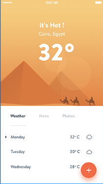

## Introduction
This walkthrough is first of a series I'm calling "UI Build It". Essentially, I just break down an interface and rebuild it using React. 

The actual steps to each of these projects in this series is to:

1. Pick an interface
2. Break it into a components
3. Organize the components into a hierarchy
4. Build a static prototype (using react props)
5. Build into a functional prototype (using react props and state)

My main goal in this series is to get a better understanding of component composition and testing within a React application. I will be using the official [Thinking In React Tutorial](https://reactjs.org/docs/thinking-in-react.html) to give my process a little structure.

## The Mock

This projects has to do with building the interface of the forecast app seen below.



### 1. Break The UI Into A Component Hierarchy

After taking a look at the interface I broke it down like so:

(image of highlighted sections)

The issues I came across had to do with reusability. I wasn't sure which components should be resused or not. At first glass the Header and Footer components seemed like they should be the same, but at second glance I decided to make them two completely different components. The reason being that they each had to represent and deal with different types of data.

The final list of components consisted of:


- `<ForecastApp />` (pink): contains the entirety of the application.
- `<ForecastAppHeader />` (teal, top): contains the current day weather details.
- `<ForecastAppFooter />` (teal, bottom): contains different views and current week data.
- `<ForecastFooterNav />` (orange): different tabs (will not be interactivefor this prototype)
- `<ForecastWeek />`(blue): contains all upcoming days and their forecast details.
- `<ForecastDay />` (red): contains the day, temperature, and icon representing the type of weather for the day

And the final component hierarchy:

```text
- <ForecastApp />
  - <ForecastAppHeader />
  - <ForecastAppFooter />
    - <ForecastFooterNav />
    - <ForecastWeek />
      - <ForecastDay />
```

### 2. Build A Static Version in React

Even though this application was small in size, I wanted to build out the application going bottom-top. So I started with the `<ForecastDay />` component.

```javascript
import React from "react";
import styled from "styled-components";
import { Cloud } from "react-feather";

const Container = styled.div`
  display: flex;
  justify-content: space-between;
  align-items: center;
`;

class ForecastDay extends React.Component {
  render() {
    const { day, temp } = this.props;
    return (
      <Container>
        <p>{day}</p>
        <p>{temp}&#8457;</p>
        <p>
          <Cloud />
        </p>
      </Container>
    );
  }
}

export default ForecastDay;
```

I imported `React`, `styled`, and `{ Cloud }` at the top. We need `React` in order for jsx to work, we import `styled` to use Styled Components, and we need `{ Cloud }` to serve for our icon, which gets imported from feather, a collection of svg icons.

We then declare our styled component named `Container` and give it its styling. I'm mainly just using this styled component as a container, so only layout styles are applied using flex box.

Next is the actual component declaration. The `<ForecastDay />` component will be taking in 3 props. It needs a day, temperature, and a weather status. Since we are just creating a static app at this point (using props, not state), I'm only taking in day and temperature and using a placeholder for the weather status. For the time being the weather status will just be an icon which was imported at the top from feather icons.

And finally we export the component.

### 3. Identify The Minimal (but complete) Representation Of UI State
[in progress]

### 4. Identify Where Your State Should Live
[queued]

### 5. Add Inverse Data Flow
[queued]